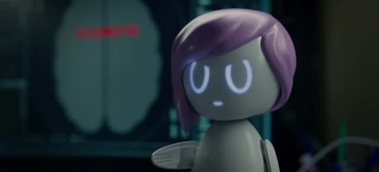

# Decorator pattern and fluent interfaces
2026-03-17



The decorator pattern is pretty useful, and I can give an example of it by reciting the
[story from Netflix](https://en.wikipedia.org/wiki/Rachel,_Jack_and_Ashley_Too).
Minor spoilers ahead, but if you didn't see this in 2019, you already missed it -
so many things have changed since then.

So, there is a singer, Ashley, who is exploring her creativity between teen pop and indie rock.
Let's define her like this.

```java
public class Ashley implements Performer {

  @Override
  public String talk() {
    String[] lines = {
        "it's so great to meet you",
        "you're a special person",
        "if you believe in yourself, you can do anything",
        "I feel desperate to break away",
        "feel the hollowness inside of your heart"};
    return lines[new Random().nextInt(lines.length)];
  }

  @Override
  public Performer dance() {
    waveHands();
    moveBody();
    jump();
    return this;
  }

  @Override
  public AudioInputStream sing() {
    throw new Error();
  }
}
```

The interface is simple, nothing special. However a uniform interface like this improves
[cohesion](https://en.wikipedia.org/wiki/Cohesion_(computer_science))
and lets us treat different Performer objects the same way.
We can prepare the stage and invite multiple singers to perform one by one in a big concert,
using the same set of audio speakers, cameras, lights, microphones, etc.
But if you disagree with the objectification of pop stars, please leave a comment below.

```java
public interface Performer {
  String talk();
  Performer dance();
  AudioInputStream sing();
}
```

The dance() method returning the Performer object itself uses a pattern called a
[fluent interface](https://en.wikipedia.org/wiki/Fluent_interface).
With a fluent interface, we can conveniently chain methods, improving readability, like this:
`new Circle().radius(5).withBorder().color(GREEN).draw();`

For the stage performance, we need another object.

```java
public class AshleyStage extends Ashley {
  @Override
  public AudioInputStream sing() {
    try {
      return AudioSystem.getAudioInputStream(new BufferedInputStream(
          Files.newInputStream(Paths.get("Right_Where_I_Belong.wav"))));
    } catch (Exception e) {
      throw new IllegalStateException();
    }
  }
}
```

AshleyStage IS-A real one - the Ashley herself. The fans will expect her to dance during the performance, so effectively
there is going to be lip sync with pre-recorded music. And look how fancy it gets with the fluent interface.

```java
new AshleyStage().dance().sing();
// and she sings and dances on the stage
```

The merchandise is equally important, and we are going to release a doll that
[HAS-A](https://en.wikipedia.org/wiki/Has-a)
personality of Ashley. It's built on a powerful framework able to contain different personalities
and even switch between them. The doll's name is Ashley Too, and it
[IS-not-A](https://en.wikipedia.org/wiki/Is-a)
real person, but it IS-A performer that can dance and sing.
Though for singing, it just plays a file, and we have no plan to make a doll of every musician.

```java
public class AshleyToo implements Performer {
  Performer[] personalities = new Performer[]{
      null, new JoanTait(), new SelmaTelse(), new ClaraRyce()
  };
  int selectedPersonality;
  Performer performer;

  public AshleyToo(Performer personality) {
    personalities[0] = personality;
  }

  public Performer wakeUp() {
    performer = personalities[selectedPersonality];
    return this;
  }

  @Override
  public String talk() {
    String s = performer.talk();
    if (s.contains("desperate")) return "it's a beautiful day";
    return s.replace("hollowness", "happiness");
  }

  @Override
  public Performer dance() {
    return performer.dance();
  }

  @Override
  public AudioInputStream sing() {
    try {
      return AudioSystem.getAudioInputStream(this.getClass().getResource("On_a_Roll.wav"));
    } catch (Exception e) {
      throw new IllegalStateException();
      // should not happen, the song is the resource
    }
  }
}
```

Basically, it is a
[decorator](https://en.wikipedia.org/wiki/Decorator_pattern)
with a few additions. We added a
[wake word](https://en.wikipedia.org/wiki/Virtual_assistant),
also chainable, the all-time favorite song "On a Roll," and some word filtering.
You know, real Ashley has her indie rock phase lately, and we don't want to disappoint the audience.

```java
AshleyToo doll = new AshleyToo(new Ashley());
doll.wakeUp().dance();
// rise and shine Ashley Too!
```

The fluent interface looks neat, and it is sad that, due to design limitations, the doll can only perform
one action at a time, and all this goodness will be left unused. But we will test it anyway, together with
the [wordfilter](https://en.wikipedia.org/wiki/Wordfilter).

```java
@Test
void testPositivity() {
  Performer doll = new AshleyToo(new Ashley()).wakeUp();
  for (int i = 0; i < 1000; i++) {
    String s = doll.talk();
    assertFalse(s.contains("desperate"));
    assertFalse(s.contains("hollowness"));
  }
}
```

Everything is great, the fans are happy, and the songs hit the charts with flying colors.
Until someone connects to the internal API and runs:

```
System.out.println(doll.wakeUp().dance().talk());
I feel desperate to break away
```

And the plot makes a fast-paced twist with a police chase, poisoning, stolen identity, and other action stuff.
