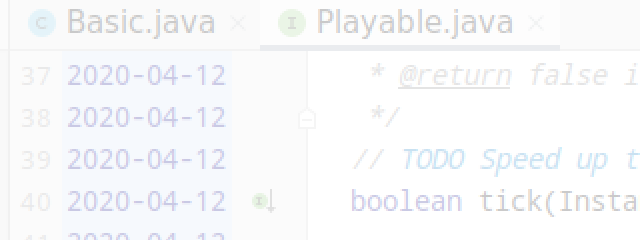
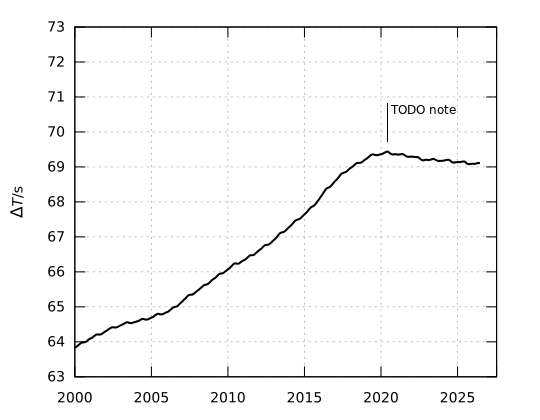

# About leap seconds and achieving goals
2026-09-06



The existence of the leap second was always a bit of trivia. Something that
occurs rarely and doesn't affect the world too much. From time to time,
someone would exclaim, "Did you know it's a leap second day today?" or draw
a funny picture about it. Or maybe someone would even write a book
about a young man lost in life who discovers the existence of leap seconds,
like [Erlend Loe](https://en.wikipedia.org/wiki/Na%C3%AFve._Super) did.

But what about you? Do you remember the first time you heard about leap seconds?
How did you feel? Tell everyone in the comments below.

People came a long way in building the time system. We learned to count, then
started counting days and years, then divided the year into days and the day
into 12x2x12x5x12x5 seconds (when people discovered that 12 is divisible by 2, 3, and 4,
they became huge fans of this number). First, we counted years by kings, then
by God's birthday. And, by the way, integers hadn't been invented yet, so the count
started from one. This is what was built from the idea of measuring time by
the Earth's rotation, which will become racist as soon as people spread across other planets.

The question that was not solved is how many days there are in a year.
The Roman Empire was, like, about 365 and 1/4, and made the Julian calendar with
a leap day on February 29 every four years. Which failed pretty fast. Astronomers were
like, hey, the solstices are drifting, fix it now. So they made an update -
the Gregorian calendar where the leap day is every four years, but no if the year
is divisible by 100, but yes again if the year is divisible by 400.
Complicated, but, win?

No. Because the Earth's orbit-to-rotation ratio is an irrational number and
cannot be expressed as the ratio of two integers. It took centuries to update
everyone to the Gregorian calendar, with late adopters catching up only 100 years ago [1],
and it had already become obvious that it didn't properly represent the
length of the day. Solution? Leap second! Just throw more seconds into the day
and pretend that the time is still in sync.

Now let me show what a kludge bugfix it is. With the calendar, we had time uniformly
spread into the past and future across the universe. Anyone knew exactly what time
it would be one billion seconds from today. But with the kludge, it is impossible
to know because of the
[dependency](https://en.wikipedia.org/wiki/Coupling_%28computer_programming%29)
on Earth's irregular rotation. The concept stops
working the moment we disconnect ourselves from Earth. Which I had a chance to observe
firsthand in 2011, when trying to synchronize the time with GPS satellites
on my new android phone. I wasn't particularly smart about it, and couldn't understand
why the time coming from the
[satellites](https://en.wikipedia.org/wiki/Global_Positioning_System#Leap_seconds)
was wrong by about 15 seconds or so.

Eventually, these time jumps were going to become a never ending
[Y2K problem](https://en.wikipedia.org/wiki/Fearmongering)
requiring constant maintenance and causing countless issues. Even though
Google's proposed solution, the leap smear, was cool, but it was still
just another kludge.

There was only one true solution.    
That day, April 12, 2020 [2], I wrote in my
[comments](https://github.com/alekseibalan/jnc/blame/main/legacy/src/main/java/ab/jnc1/Playable.java):
```java
// TODO Speed up the planet and eliminate the leap seconds
```

And then I worked toward this dream every day, from early morning until night.
I stayed focused. I made sacrifices. I ignored the doubts, even when
people told me it wasn't possible and that I should choose more realistic goals.

Six years passed.

Result achieved:
[28](https://www.timeanddate.com/time/earth-faster-rotation.html)
of the shortest days since 1960 occurred in 2020, beginning in June.
"The Earth is spinning faster now than at any time in the past half century,"
reported The Daily Telegraph.

Result achieved: In November 2022, at the 27th General Conference on Weights and Measures,
it was decided to
[abandon](https://en.wikipedia.org/w/index.php?title=Leap_second&oldid=1138262710)
the leap second by or before 2035

Result achieved: Over the last six years, the Earth's rotation increased, reducing
[delta-T](https://en.wikipedia.org/wiki/%CE%94T_%28timekeeping%29) by approximately 0.2 seconds.



It was possible.    
Not because I was lucky.    
Not because the world handed it to me.    
But because of setting the right priorities and refusing to accept anything less than success.

And if it was possible to change the spin of the Earth, you can achieve anything.

Thanks for reading.

\[1\]: Turkey in 1926

\[2\]: damn it, now I have to keep this trashy interface file forever
