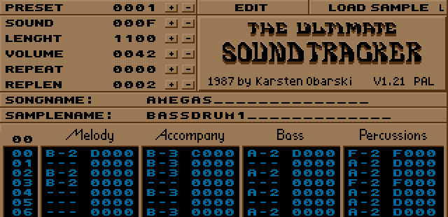

# MIDI and .mod - the standards that defined computer music
2026-04-04

During the work on the TNS sound system, I had to read a lot of documentation
about the MIDI musical interface and the .mod file format, as I considered
them to be the two most important formats that the sound system must support.
And I found a lot of interesting moments that I would like to share.

### MIDI

A bit of context. After the early cautious attempts in the field of home
computers in the 70s, the 80s exploded with all kinds of computing stuff:
C64, Compact Disc, Spectrum, Mario (NES), Windows! The CD is praised as being
one of the longest-living standards since its release in 1982, but hold
the beer for MIDI. Its first instruments were released in 1983, and the 
standard has stayed forever. I can buy a modern Arturia synth and
connect it to an MMT-8, I can and I will.

The formula for success is simplicity plus versatility. The hardware part
is just a wire with the current as low as just enough to power an LED lamp,
and a photo sensor providing
[isolation](https://en.wikipedia.org/wiki/Opto-isolator)
between devices - no short circuits, no ground loops. Light on and off
encoding 0 and 1 - it is literally an optical serial port. The MIDI messages
sent to this port are: Note On (3 bytes - command code, channel, note, and
velocity), Note Off, Program Change (changes the instrument - piano or guitar),
and Control Change (3 bytes - command code, channel, control number,
control value - changes some additional options of the channel). Simple.

Oh, and there are also one-byte Start, Stop, and Clock messages, which let one
synchronously start and play music on many synths. After starting, a one-byte
Clock message is sent 24 times per beat
([24 PPQ](https://en.wikipedia.org/wiki/MIDI_beat_clock) pulses per quarter),
so for an average pop tempo of 120 BPM, the clock frequency will be
120 / 60 * 24 = 48 Hz. Why is it 24? Probably for the same reason we have
24 hours - many divisors, including 3.

### Fifteen minutes of fame

Getting back to the legends of the 80s: already famous for its nice sound
chip SID in the C64, Commodore released the Amiga series in 1985, which were
way ahead of time in their multimedia features. Thousands of colors, and yes,
once again, a nice sound chip Paula \[1\] with wavetable synthesis and
customizable samples - something that the PC community got only ten years
later. It was a planted seed ready to sprout.

And it did in 1987, when Karsten Obarski released The Ultimate Soundtracker.
Long story short, the program was disassembled and the source code was
distributed among the warez scene. Unauthorized development started, with
modifications to the file format, adding features and effects, and the author
lost control over the software. He even tried to catch up by adding support for
modded features, but it was too late. From time to time, people get nostalgia
attacks and ask themselves, "What happened to Karsten Obarski?" He is home,
no worries, he's in perfect health in there and he can unroll when he chooses
to, but can also stay in metabolic hibernation pretty much indefinitely.

A sad story, but inevitable. The first tracker was so good because it was
a thin API to the sound chip - simplicity plus versatility. There was almost
nothing to code, and any advanced programmer could recreate it from scratch.
There are hundreds of trackers exist proving this, and each of them can be
considered a clone. The thing that makes the first tracker special is not
the code, but the combination of features.

### .mod design

Let me reverse-engineer the design.

So we have an Amiga 500 PAL. It has a 50 Hz screen rate, PAL
[colorburst](https://en.wikipedia.org/wiki/Colorburst)
of 4433618.75 Hz, and a CPU clock of 4433618.75 * 8 / 5 = 7093790 Hz,
because the computer architecture was built around the video system -
the hardware fashion of that time.
We want to play music, and we need 120 BPM (2 Hz), with alternating bass drum
and snare on the left channel and a repeating synth bass on the right. We need
granularity at least 4 times higher to play a 1/16 hihat groove (8 Hz).

We have an interrupt for VSYNC triggering at 50 Hz, and we want to use it
to run the music while the CPU runs something else (the game or video effect).
The solution found: divide 50 Hz by 6. The resulting BPM will be 125, which is
what we desire. Let's call the 50 Hz event a "tick", and call the divider 6
a "speed", and change it to adjust BPM.

Design defect: we just limited ourselves to 83 (speed 9), 94 (speed 8),
107, 125, 150, 188, 250(?) BPM.

We also have effects that change their value over time - volume slide,
arpeggio, portamento. Let the tick handle these small changes between
1/16 notes.

Design defect: with increasing music speed (and decreasing the speed divider),
the effects start to sound  different, because there are fewer ticks
between notes.

To start the sound, all we need are: instrument number 1-15 (0 means the
current one), note C-1, C#1, D-1, up to B-3, and an effect. There is no need
for a Note Off command: we either start a new sound, mute the volume, or
the sample ends by itself. No need for a channel either - each channel has
its own note sequence. Three bytes should be enough - byte for note, nibble
for instrument, nibble for effect ID, and byte for effect value.

Design defect: it turns out to be 4 bytes - we keep a 16-bit frequency divider
instead of a note number. \[2\]

| channel 1  | channel 2  | channel 3  | channel 4  |
| ---------- | ---------- | ---------- | ---------- |
| 011D 1 000 | 0280 D 000 | 023A 6 000 | 00FE D 000 \[3\] |
| 0000 0 000 | 0000 0 000 | 0000 0 000 | 00FE D 000 |
| 011D 0 000 | 0000 0 000 | 0000 0 000 | 00FE D 000 |

To play the sample on the sound chip, we need a divider. The divider here is
the number of CPU cycles (x2) to wait before advancing to the next PCM value.
To play a 22050 Hz sample, the divider will be 7093790 / 2 / 22050
= 161 (160.8).

Let's choose the period of the sampled data to be equal to 128 bytes \[4\].
We can do this, for example, by recording the note A-1 (55 Hz) at a rate
of 7040 Hz. Then we calculate the divisors for octaves 1-3 using this period.
The playback rate for A-1 is 7040 Hz, and the divisor will be
7093790 / 2 / 7040 = 504 (503.8).

But wait, why is it 508 in the tracker's code?

Bug: the calculation was made using the CPU clock of an NTSC computer,
probably by taking data from the wrong manual. NTSC
[colorburst](https://en.wikipedia.org/wiki/Colorburst)
rate is 3579545.45 Hz, and the CPU clock is 3579545.45 * 2 = 7159090.9 Hz.
As a result of this typo, all played notes were 11 cents flat.

Bug: the divider of B-3 gives the playback rate 7093790 / 2 / 113 = 31388 Hz,
which exceeds the DMA speed limit of
[28837 Hz](https://en.wikipedia.org/wiki/Amiga_Original_Chip_Set#Paula)
and corrupts the sound. The bug is well known in the Amiga community, and
it is recommended to avoid B-3.

So, how do we play our 128-byte instrument beyond the 3rd octave? Simple:
scale it to 64 bytes to go one octave up, 32 bytes give a 2-octave increment,
and 16 bytes give 3 octaves, resulting in C-1 and C-3 sounding like
C-4 and C-6. \[5\] Alternatively, we can improve the quality of
bass instruments by sampling them at double rate.

Example from the first tracker music *amegas.mod* - it is the reference piece.

| instrument   | period | played | sounds |
| ------------ | ------ | ------ | ------ |
| popbass      |    256 |    G-2 |    G-1 |
| synbrass     |     32 |    G-3 |    G-5 |
| strings3     |     16 |    D-2 |    D-5 |
| dangerous    |     64 |    B-2 |    B-3 |
| jahrmarkt1   |     16 |    C-3 |    C-6 |
| analogstring |    128 |    G-1 |    G-1 |
| detune       |    128 |    G-2 |    G-2 |

Both strings here have loops, allowing long sustained sound. The loop is defined
by the sample begin and end points, specified in the instrument description.

Design defect: without a Note Off command, it is impossible to exit the sustain
loop. The sample data beyond the end point becomes inaccessible, and the
musician needs to fade out the strings somehow to simulate the release phase.
But maybe it was a hardware limitation of the chip - if you know how to exit
the sustain loop on the Amiga, please leave a comment below.

### .mod modding

Despite all the issues, this is a pretty good design, and it was accepted
and copied, fully or partially, by all other trackers. Once it was designed
well, it was easy to reproduce, even without disassembling.

Text interface - this was the best thing. Most music programs of the time
tried to replicate sheet music, which had been used for centuries (see
[functional fixedness](https://en.wikipedia.org/wiki/Functional_fixedness)).
But the moment the time flow changed direction from left-to-right to top-down,
we got a full text string for every moment in time, and could encode a lot
of information at once.

One thing that I find exciting in the first .mod format is the 15-instrument
limit. This aligns pretty well with the MIDI specification of 1 channel
for drums and 15 channels for instruments, allowing one to make a player that
plays each .mod instrument on a dedicated hardware synthesizer. Though the
15-instrument limit, as well as other annoying limitations, was fixed pretty
soon by followers. The number of instruments was increased to 31. One bit was
added to the frequency divider word to address the upper 16 instruments.

Design defect: the idea was to occupy the first nibble of the frequency
divider, which was empty all the time, and this could give 255 instruments.
But the developer limited the instrument table to 31 entries and put the file
signature behind it, making further improvements complicated.

The number of channels was increased from 4 to 64 at the cost of
software mixing.

The number of octaves increased from 3 to 5. Two more octaves were added -
one above and one below, further breaking the DMA speed limit. Nobody cared
about Amiga limits when .mod files started spreading to all platforms.

Obviously, more effects. Hardware effects in .mod and software effects in
other formats. \[6\]

The NTSC frequency error was fixed simply by treating frequency dividers
as notes. If there is 508, I do not do any calculations with it - I just know
that 508 is A-1, and keep a table of constants for it.

Most importantly, the tick was untied from screen sync and became just
a variable timer interrupt. This solved the limited choice of BPMs, and by
keeping the divider at the default value of 6, we can change BPM
while keeping effects consistent.

But what is most magical - the tick frequency per beat is
(4 (16th note granularity) * 6 (default divider)) = 24, and this is exactly
the same as the default MIDI PPQ, giving us the possibility to
[control .mod playback](https://youtu.be/7vU1Q5UbKnE)
with a hardware MIDI clock and vice versa - syncing hardware sequencers
playback with .mod playback. We get one MIDI clock event - we perform one
.mod tick. No synchronization routine, compatibility out of the box.

Thanks for reading.

\[1\]: Amiga, Paula - you got the pattern.

\[2\]: One Finnish group had their own .mod format with note numbers,
fixing this.

\[3\]: dividers: 11D - G-2, 23A - G-1, instruments: 1 - popbass, D - hihat2,
6 - analogstring

\[4\]: 128 is a good choice for many reasons - scaling up and down,
FFT processing, always perfect loops.

\[5\]: Other trackers usually display the Soundtracker notes two or three
octaves higher.

\[6\]: *modfil11.txt*, written at that time, is a good source of information
about all .mod effects.
